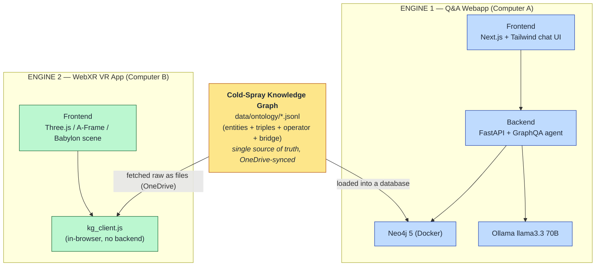
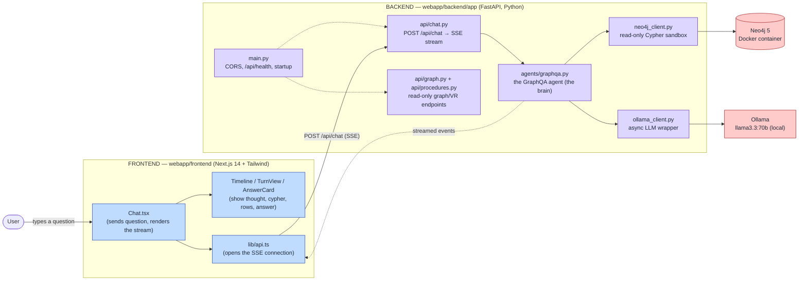
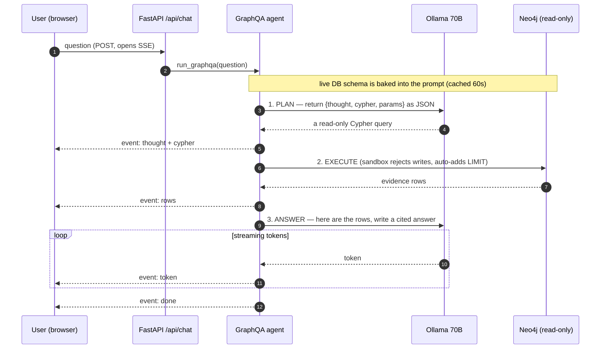
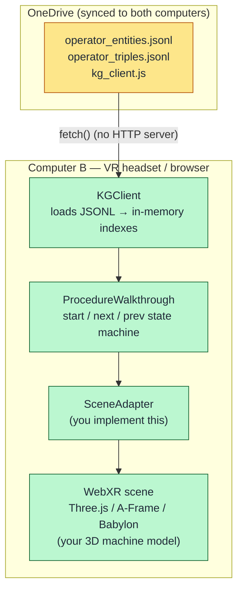
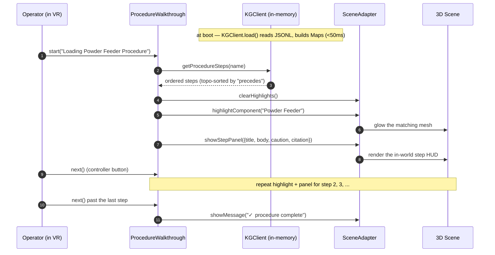

# Cold-Spray KG — Overall Working Engine

_An explainer of how the whole system fits together: the shared knowledge graph, the two
applications that consume it, what is "frontend" vs "backend" in each, and the end-to-end
workflows. Diagrams are Mermaid — they render in VS Code (with a Mermaid extension), on
GitHub, and in most Markdown viewers._

---

## 1. The one-sentence story

A single, hand-curated **cold-spray knowledge graph** (plain `.jsonl` files) is the source of
truth. Two completely different apps consume it:

1. **The Q&A webapp** — a server-backed chatbot that turns a natural-language question into a
   Neo4j query and a cited answer (uses a local LLM).
2. **The WebXR VR training app** — a *backend-less* browser app that loads the graph directly
   and drives an in-headset, step-by-step machine-operation walkthrough.



**The key contrast:** Engine 1 has a real frontend/backend split (browser talks to a server).
Engine 2 has *no backend at all* — the "server logic" is a JavaScript module running inside the
browser, reading files off disk. Same data, two opposite architectures.

---

## 2. The shared data layer (the knowledge graph)

Everything starts here. The graph is stored as line-delimited JSON in `data/ontology/`:

| File | What it holds |
|---|---|
| `entities.merged.jsonl` | Nodes — every entity, typed (e.g. `Material.Powder`, `Process.GasParameter`). |
| `operator_entities.jsonl` | Operator-domain nodes from the WarpSPEE3D manual (faults, procedures, components, hazards). |
| `triples.audited.jsonl` | Literature relationships, each carrying `context` (evidence quote), `source_paper`, `confidence`. |
| `triples.nli_scored.jsonl` | Adds NLI scores (`confidence_nli`, entails / neutral / contradicts) to literature edges. |
| `operator_triples.jsonl` | Operator-domain relationships (`scope='operator'`). |
| `bridge_triples.jsonl` | `:CORRESPONDS_TO` edges (`scope='bridge'`) linking a literature entity to its operator counterpart. |

Two things make this graph usable by both engines:

- **It's just files.** No database is *required* to read it — a browser can `fetch()` the JSONL
  directly. Neo4j is an optional accelerator, not a dependency of the data.
- **Provenance lives on the edges.** Every relationship knows which paper/manual-slide it came
  from and the exact quote, so any answer or VR step can be cited.

---

## 3. Engine 1 — the Q&A Webapp

A user asks a question in plain English; the system writes the database query for them, runs it
safely, and writes back a cited answer.

### 3.1 Frontend vs backend



- **Frontend** (`webapp/frontend`): Next.js + Tailwind. Its only job is to send the question and
  render the streamed events as they arrive — the plan, the generated query, the evidence rows,
  and the final answer.
- **Backend** (`webapp/backend/app`): FastAPI. It exposes the chat endpoint, runs the agent,
  guards the database, and talks to the LLM.
- **Data store**: Neo4j 5 in Docker, loaded once from the JSONL via `scripts/load_kg.py`.
- **LLM**: Ollama running `llama3.3:70b` locally — used both to *write* the query and to *write*
  the answer.

### 3.2 The GraphQA agent loop (the workflow)

This is the heart of Engine 1. One question → three steps → a cited, streamed answer.



**Step by step:**

1. **Plan.** The agent builds a system prompt that includes the *live* graph schema (actual
   labels, relationship types, and edge patterns, refreshed every 60 s) and asks the LLM for a
   read-only Cypher query as strict JSON: `{thought, cypher, params}`.
2. **Execute.** `neo4j_client.cypher_query` runs the query — but first a safety filter
   **rejects any write** (`CREATE / MERGE / DELETE / SET / DROP / …`) and auto-appends a `LIMIT`
   so a bad query can't dump the whole graph. The session is opened in READ-only access mode.
3. **Answer.** The returned rows are fed back to the LLM, which **streams** a 3–6 sentence answer
   where every claim is cited as `(source_paper)`.

Each stage is pushed to the browser as a typed **Server-Sent Event** (`thought`, `cypher`,
`rows`, `token`, `done`, `error`), which is why the UI can show the reasoning, the query, and the
evidence *inline* instead of just a final blob of text.

### 3.3 Safety model (worth calling out when you explain it)

- The LLM can only ever produce **read** queries — writes are blocked by regex *and* by Neo4j's
  READ access mode (defense in depth).
- Results are always bounded by `LIMIT`.
- Answers are grounded in the rows that were actually returned, and cited — so the system can't
  silently hallucinate a fact that isn't in the graph.

---

## 4. Engine 2 — the WebXR VR Training App

This is the part you called "the webxr." It guides an operator through a real WarpSPEE3D
procedure inside a VR headset, highlighting the right 3D component at each step and showing the
verbatim instruction with its manual citation.

### 4.1 Why there's no backend

The KG lives on **Computer A**; the VR app is built on **Computer B**; they share the repo only
through **OneDrive**. OneDrive can sync *files* but not *running services* — so the VR app
**does not call any server**. Instead it `fetch()`es the ~950 KB of operator JSONL straight off
the synced folder and answers every walkthrough query in the browser, in memory.



So in Engine 2, **`kg_client.js` *is* the backend** — it just happens to run inside the same
browser as the frontend. It mirrors the exact same API as the Python endpoints in
`webapp/backend/app/api/procedures.py` (`listProcedures`, `getProcedureSteps`, `getComponent`,
…), so if you ever co-locate the two computers you can swap the in-browser client for HTTP calls
without changing the VR code.

### 4.2 The walkthrough workflow



- **`KGClient`** loads the two JSONL files once and builds lookup Maps (`byId`, `byName`,
  `byType`, `outgoing`, `incoming`). After that, every query is synchronous and returns in
  ~2 ms.
- **`ProcedureWalkthrough`** is the state machine: `start()`, `next()`, `prev()`, `jumpTo()`. On
  each step it tells the scene what to highlight and what panel to show.
- **`SceneAdapter`** is the *only* part the VR developer writes. It has four optional methods —
  `highlightComponent`, `clearHighlights`, `showStepPanel`, `showMessage` — that translate
  KG-speak ("highlight the Powder Feeder") into your engine's calls (glow this `THREE.Mesh`).
- A `component_mapping.json` (authored by hand on the VR side) maps 3D mesh names →
  exact KG component names. That's the one manual bridge between the graph and the geometry.

There's a ready-to-run reference demo at `vr_kg_client/demo/index.html` that drives the whole
loop with a console-logging adapter — useful to show the data flow before any 3D is wired up.

---

## 5. The two engines side by side

| | **Engine 1 — Q&A Webapp** | **Engine 2 — WebXR VR App** |
|---|---|---|
| **Runs on** | Computer A (server stack) | Computer B (browser only) |
| **Frontend** | Next.js + Tailwind chat | Three.js / A-Frame / Babylon scene |
| **Backend** | FastAPI (Python) | **none** — `kg_client.js` in the browser |
| **Data source** | Neo4j (loaded from JSONL) | raw JSONL via OneDrive |
| **Uses the LLM?** | Yes (Ollama 70B) | No |
| **Graph scope** | literature + operator + bridge | operator only |
| **Answers** | open-ended Q&A, cited | fixed procedure walkthroughs |
| **Latency driver** | LLM (seconds) | in-memory lookups (<2 ms) |
| **Needs Docker/Python?** | Yes | No |

**One graph, two front doors.** When you explain it, the headline is: the curated KG is the
asset; the webapp proves you can *ask it anything* with citations, and the VR app proves the same
knowledge can *drive a hands-on training experience* with zero server infrastructure.

---

## 6. Where each piece lives (quick map)

```
cold_spray_kg - Copy/
├── data/ontology/*.jsonl          ← the knowledge graph (shared source of truth)
│
├── webapp/                        ← ENGINE 1
│   ├── docker-compose.yml         ← Neo4j 5 + APOC
│   ├── backend/app/
│   │   ├── main.py                ← FastAPI entrypoint, CORS, /api/health
│   │   ├── api/chat.py            ← SSE chat endpoint
│   │   ├── api/graph.py           ← schema / entity / cypher inspection
│   │   ├── api/procedures.py      ← VR-facing procedure + component endpoints
│   │   ├── agents/graphqa.py      ← the 3-step GraphQA agent
│   │   ├── neo4j_client.py        ← read-only Cypher sandbox
│   │   └── ollama_client.py       ← local LLM wrapper
│   └── frontend/                  ← Next.js chat UI (Chat.tsx + components/)
│
├── vr_kg_client/                  ← ENGINE 2
│   ├── kg_client.js               ← in-browser KG client + walkthrough state machine
│   └── demo/index.html            ← standalone end-to-end demo
│
└── VR_INTEGRATION.md              ← the full VR-side integration contract
```
